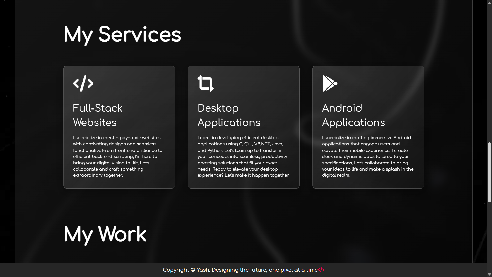

# Personal Portfolio Website - Yash Balotiya 🌑

A simple, elegant and responsive **single-page personal portfolio** website designed and developed by **Yash Balotiya**. The site is crafted using basic **HTML, CSS and JavaScript** with a **neat and clean dark theme** for modern aesthetics and ease of navigation.

Website: [https://balotiyash.github.io/Personal-Portfolio/](https://balotiyash.github.io/Personal-Portfolio/)

---

## 🌟 Overview

This website is a personal portfolio showcasing my professional profile, skills, projects and contact information. It's designed with minimalism and clarity in mind, making it easy for visitors to learn more about my background and get in touch.

---

## 📌 Sections

- **About Me**  
  A short introduction and professional background summary.

- **Qualifications**  
  Educational milestones and certifications.

- **Experience**  
  Work history and professional experience overview.

- **Skills**  
  Technical and soft skills displayed in a clean visual format.

- **Services**  
  Overview of services offered as a developer/professional.

- **Projects / Work**  
  Showcase of selected projects with links (if applicable).

- **Contact Form**  
  A simple form for visitors to reach out directly.

- **Social Media Links**  
  Icons linking to various social platforms for broader reach.

---

## 🛠️ Tech Stack

- **Frontend:** HTML, CSS, JavaScript  
- **Theme:** Dark Mode  
- **Design:** Clean, responsive and user-friendly interface

---

## 📸 Screenshots
- **Screenshots**

---

## 🧑‍💻 Developer Info

**Developer:** Yash Balotiya   
**LinkedIn:** [@balotiyash](https://www.linkedin.com/in/balotiyash)  
**GitHub:** [@balotiyash](https://github.com/balotiyash)   
**Website:** [Portfolio](https://balotiyash.github.io/Personal-Portfolio/)  
**Email:** (balotiyash@gmail.com)

---

## 📄 License

This project is open-source and free to use for personal inspiration or learning. Attribution appreciated.